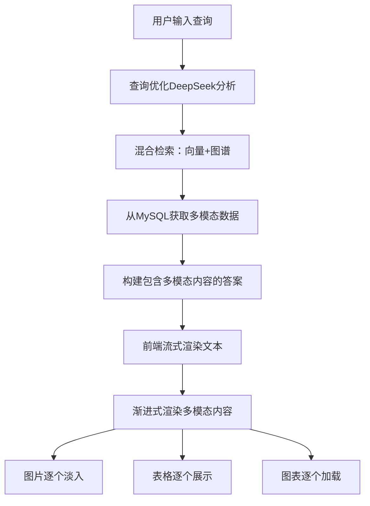

# 🎨 GraphRAG多模态流式渲染功能说明

## 📋 功能概述

GraphRAG系统现在支持类似ChatGPT的多模态流式渲染效果，能够在智能问答过程中动态展示图片、表格、图表等多媒体内容，提供丰富的视觉体验。

## 🔄 工作流程

### 完整的多模态检索渲染链路



## 🎯 使用示例

### 示例1：产品说明查询

**用户输入：** \"帮我查询一下CHO细胞表达系统的产品说明\"

**系统处理流程：**
1. **查询优化**: \"帮我查询一下CHO细胞表达系统的产品说明\" → \"CHO细胞表达系统\"
2. **向量检索**: 匹配相关文档内容
3. **多模态提取**: 从MySQL获取相关图片、表格、图表
4. **答案生成**: 生成包含文本和多模态引用的答案
5. **流式渲染**: 
   - 先逐字符显示文本答案
   - 然后逐个淡入显示相关图片
   - 接着展示产品规格表格
   - 最后显示工艺流程图表

### 示例2：技术文档查询

**用户输入：** \"蛋白质纯化工艺的详细流程\"

**渲染效果：**
```
🤖 助手正在回答...

CHO细胞表达系统是一种广泛应用于生物制药的蛋白质表达平台...

[流式显示完文本后，开始渐进渲染多模态内容]

🖼️ 图片 img_001
📷 CHO细胞培养设备图
[图片淡入效果]

📊 表格 table_001  
生产工艺参数对照表
[表格从上到下逐行显示]

📈 图表 chart_001
纯化工艺流程示意图
[图表描述渐进显示]
```

## 🔧 技术实现

### 后端增强 (SearchService.py)

#### 1. 多模态数据提取
```python
def question_answering(self, question: str, context_limit: int = 5):
    # 检索相关文档
    search_results = self.hybrid_search(question, top_k=context_limit)
    
    # 提取多模态内容
    multimodal_content = {
        'images': [],
        'tables': [], 
        'charts': []
    }
    
    for result in search_results['combined_results']:
        if 'chunk_id' in result:
            chunk_multimodal = self._get_chunk_multimodal_content(result['chunk_id'])
            if chunk_multimodal:
                multimodal_content['images'].extend(chunk_multimodal.get('img', []))
                multimodal_content['tables'].extend(chunk_multimodal.get('table', []))
                multimodal_content['charts'].extend(chunk_multimodal.get('chars', []))
```

#### 2. 返回格式增强
```python
result = {
    'question': question,
    'answer': answer,
    'context': relevant_docs,
    'search_results': search_results,
    'multimodal_content': multimodal_content,  # 🔥 新增多模态数据
    'query_optimization': query_optimization_info,
    'timestamp': datetime.now().isoformat()
}
```

### 前端渲染 (main.js)

#### 1. 渐进式流式渲染
```javascript
async streamMessage(content, multimodalContent = null) {
    // 第一阶段：流式显示文本内容
    // 第二阶段：渐进渲染多模态内容
    await this.progressiveRenderMultimodal(contentDiv, content, multimodalContent);
}
```

#### 2. 多模态内容解析
```javascript
renderMultimodalContent(multimodalContent) {
    let elements = [];
    
    // 渲染图片
    if (multimodalContent.images && multimodalContent.images.length > 0) {
        elements.push(this.renderImages(multimodalContent.images));
    }
    
    // 渲染表格
    if (multimodalContent.tables && multimodalContent.tables.length > 0) {
        elements.push(this.renderTables(multimodalContent.tables));
    }
    
    // 渲染图表
    if (multimodalContent.charts && multimodalContent.charts.length > 0) {
        elements.push(this.renderCharts(multimodalContent.charts));
    }
    
    return elements.length > 0 ? 
        `<div class=\"multimodal-content\">${elements.join('')}</div>` : '';
}
```

#### 3. 流式渲染动画
```javascript
async streamRenderImages(container, images) {
    for (let i = 0; i < images.length; i++) {
        const imageItem = document.createElement('div');
        imageItem.className = 'multimodal-item image-item fade-in';
        
        container.appendChild(imageItem);
        this.scrollToBottom();
        await this.delay(300);  // 逐个显示，间隔300ms
    }
}
```

### CSS样式 (style.css)

#### 1. 流式加载动画
```css
.multimodal-content.streaming {
    border-left: 3px solid var(--accent-primary);
    animation: streaming-pulse 1.5s ease-in-out infinite;
}

@keyframes streaming-pulse {
    0%, 100% { border-left-color: var(--accent-primary); }
    50% { border-left-color: var(--accent-hover); }
}
```

#### 2. 淡入效果
```css
.multimodal-item {
    opacity: 0;
    transform: translateY(10px);
    transition: all 0.3s ease;
}

.multimodal-item.fade-in {
    animation: fadeInUp 0.5s ease forwards;
}

@keyframes fadeInUp {
    to {
        opacity: 1;
        transform: translateY(0);
    }
}
```

## 📊 数据结构说明

### 多模态内容数据格式

```json
{
  \"multimodal_content\": {
    \"images\": [
      {
        \"element_id\": \"img_001\",
        \"file_path\": \"/upload/images/cho_system.jpg\",
        \"description\": \"CHO细胞表达系统示意图\",
        \"page_number\": 1,
        \"coordinates\": {\"x\": 100, \"y\": 200}
      }
    ],
    \"tables\": [
      {
        \"element_id\": \"table_001\",
        \"title\": \"生产工艺参数表\",
        \"summary\": \"CHO细胞培养的关键参数对照\",
        \"table_data\": [
          {\"参数\": \"温度\", \"数值\": \"37°C\", \"范围\": \"36-38°C\"},
          {\"参数\": \"pH\": \"7.2\", \"范围\": \"7.0-7.4\"}
        ]
      }
    ],
    \"charts\": [
      {
        \"element_id\": \"chart_001\",
        \"description\": \"蛋白质纯化工艺流程图，展示了从细胞培养到最终产品的完整流程\"
      }
    ]
  }
}
```

## 🎨 渲染效果特点

### 1. **ChatGPT风格的流式体验**
- ✅ 文本逐字符流式显示
- ✅ 多模态内容渐进式加载
- ✅ 平滑的动画过渡效果
- ✅ 自动滚动跟随

### 2. **丰富的视觉元素**
- 🖼️ **图片展示**: 支持缩放、加载占位符、错误处理
- 📊 **表格渲染**: 响应式表格、粘性表头、悬停效果
- 📈 **图表描述**: 清晰的图表说明和引用
- 🔗 **内联引用**: 支持点击跳转的多模态引用

### 3. **优秀的用户体验**
- 📱 **响应式设计**: 移动端友好的布局
- 🎯 **无障碍访问**: 语义化HTML结构
- 🎨 **暗黑主题**: 统一的设计风格
- ⚡ **性能优化**: 渐进加载，避免阻塞

## 🚀 使用建议

### 1. **查询优化建议**
- 使用具体的专业术语 (如\"CHO细胞\", \"蛋白质纯化\")
- 避免模糊的修饰词 (如\"帮我查询\", \"相关内容\")
- 针对多媒体内容的查询效果更佳

### 2. **内容组织建议**
- 确保PDF文档包含清晰的图片和表格
- 使用结构化的标题和说明文字
- 保持图片路径的正确性

### 3. **性能考虑**
- 多模态内容较多时会增加加载时间
- 图片文件建议压缩优化
- 表格数据量大时会影响渲染性能

## 🔮 未来扩展

### 计划中的增强功能
1. **实时预览**: 悬停显示多模态内容预览
2. **全屏查看**: 点击图片/表格进入全屏模式
3. **内容导出**: 支持导出包含多模态内容的报告
4. **智能标注**: AI自动为图片生成更详细的描述
5. **交互式图表**: 支持可交互的数据图表

通过这个多模态流式渲染功能，GraphRAG系统现在能够提供更加丰富、直观的智能问答体验，让用户不仅能获得文本答案，还能看到相关的图片、表格等视觉内容，真正实现了多模态智能检索的目标。🎉
