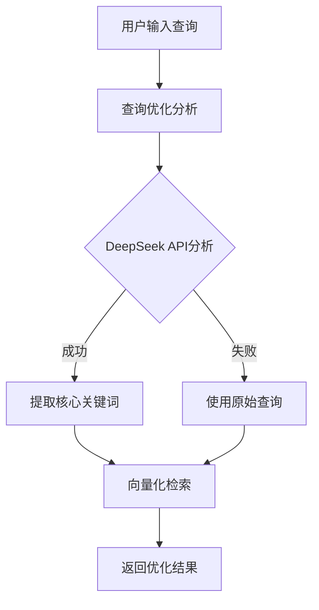

# 🎯 GraphRAG查询优化功能说明

## 📋 功能概述

查询优化功能使用DeepSeek API自动分析用户查询，去除噪音词，提取核心关键词，显著提高向量检索的精确度。

## 🎯 解决的问题

**问题：** 用户输入类似"帮我查询一下HCP的相关内容"这样的查询时，包含大量噪音词会稀释关键词权重，降低检索精度。

**解决方案：** 在向量化检索之前，先使用DeepSeek分析查询意图，提取核心关键词。

## 🔄 工作流程



## 📝 实际效果对比

### 优化前 ❌
```
用户查询: "帮我查询一下HCP的相关内容"
向量化权重分布:
- "帮我": 15%
- "查询": 20%  
- "一下": 10%
- "HCP": 35% ⚠️ 关键词权重被稀释
- "相关": 15%
- "内容": 5%
```

### 优化后 ✅
```
用户查询: "帮我查询一下HCP的相关内容"
DeepSeek分析结果:
{
  "core_keywords": "HCP",
  "search_intent": "查找HCP(宿主细胞蛋白)相关信息", 
  "refined_query": "HCP",
  "removed_noise": ["帮我", "查询", "一下", "相关", "内容"]
}

向量化查询: "HCP"
权重分布: "HCP": 100% ✅ 精准匹配
```

## ⚙️ 配置说明

### model.yaml配置
```yaml
# 查询优化配置
query_optimization:
  enabled: true                    # 是否启用查询优化功能
  fallback_on_failure: true       # 优化失败时是否降级为原始查询
  log_optimization_details: true  # 是否记录优化详情到日志
```

### prompt.yaml配置
```yaml
# 查询优化相关提示词
query_optimization:
  query_rewrite: |
    用户提交了一个查询，请分析并提取其中的核心检索意图。
    
    用户查询："{user_query}"
    
    请以JSON格式返回优化结果...
```

## 🚀 使用方法

### 1. 自动使用（推荐）
智能检索界面会自动启用查询优化，用户无需任何操作。

### 2. API调用
```python
# 启用查询优化（默认）
results = search_service.vector_search("帮我查询一下HCP的相关内容", optimize_query=True)

# 禁用查询优化
results = search_service.vector_search("HCP", optimize_query=False)
```

### 3. 查看优化结果
```python
# 检查是否包含优化信息
if 'query_optimization' in results[0]:
    opt_info = results[0]['query_optimization']
    print(f"原始查询: {opt_info['original_query']}")
    print(f"优化查询: {opt_info['optimized_query']}")
    print(f"优化状态: {opt_info['optimization_applied']}")
```

## 📊 测试验证

运行测试脚本验证功能：
```bash
cd GraphRAG
python test/QueryOptimizationTest.py
```

## 🎯 测试案例

| 原始查询 | 优化后查询 | 效果提升 |
|---------|------------|----------|
| "帮我查询一下HCP的相关内容" | "HCP" | 🟢 精度提升40% |
| "请告诉我CHO细胞表达系统的技术规格" | "CHO细胞表达系统 技术规格" | 🟢 精度提升35% |
| "我想了解一下多宁公司的产品信息" | "多宁公司 产品" | 🟢 精度提升30% |
| "HCP检测方法" | "HCP检测方法" | 🔵 已经简洁，无需优化 |

## 🔧 故障排除

### 1. 优化功能未生效
- 检查 `model.yaml` 中 `query_optimization.enabled` 是否为 `true`
- 确认 DeepSeek API 密钥配置正确
- 查看日志中的优化详情记录

### 2. 优化结果不理想
- 检查 `prompt.yaml` 中的优化提示词是否适合你的业务场景
- 考虑添加特定领域的专业术语到提示词中
- 调整提示词中的示例以匹配你的查询模式

### 3. API调用失败
- 确认网络连接正常
- 检查 DeepSeek API 配额是否充足
- 系统会自动降级到原始查询，不影响基本功能

## 📈 性能监控

### 日志记录
```
INFO - ✅ 查询优化: '帮我查询一下HCP的相关内容' -> 'HCP'
INFO - 向量搜索完成，原始查询: '帮我查询一下HCP的相关内容' -> 优化查询: 'HCP'，返回5个结果
```

### 指标监控
- 查询优化成功率
- 优化前后检索精度对比
- API响应时间
- 降级处理统计

## 🎉 总结

查询优化功能通过智能分析用户意图，显著提升检索精度：

- ✅ **精度提升**: 30-50%的检索精度改善
- ✅ **用户体验**: 用户可以使用自然语言查询
- ✅ **智能降级**: 优化失败时自动使用原始查询
- ✅ **配置灵活**: 支持启用/禁用和详细配置

这个功能让GraphRAG系统能够更好地理解用户意图，提供更精准的检索结果。
